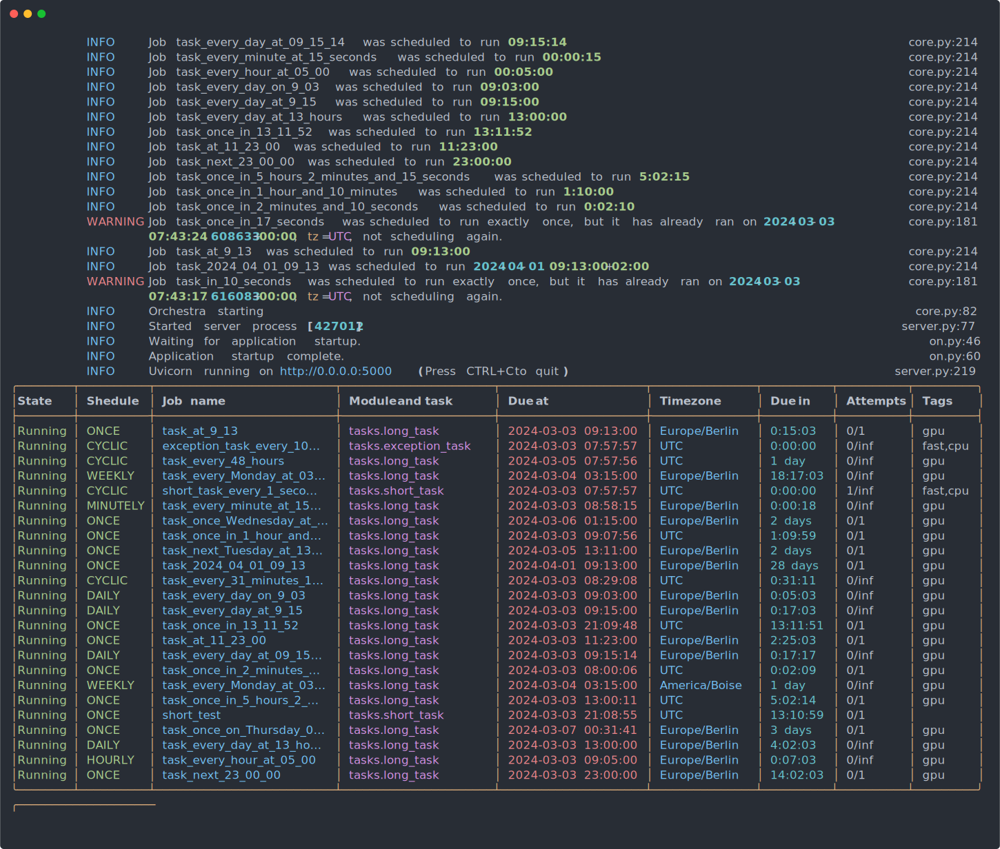

# Orchestra

Orchestra is:
- an asyncio based job scheduler
- using [Celery](https://docs.celeryq.dev/) (which is a distributed task queue) under the hood for running tasks/jobs
- using [scheduler](https://digon.io/hyd/project/scheduler/t/master/readme.html) under the hood which is a simple in-process python scheduler library with asyncio, threading and timezone support.



## Dependencies
- python >= 3.11.7
- celery > 5.3.6
- sqlalchemy > 2.0.25
- psycopg2-binary
- scheduler > 0.8.5
- pytz > 2023.3.post1

## Installation

Install from pypi:

```bash
pip install pyorchestra
```

## Getting started

### Schedule definition

```yaml
- name: sample-tasks # optional name for this block, this has no bearing on how orchestra works whatsoever, you may name your blocks in any way
  module: tasks # this is the python module where celery will look for the task
  schedules: # a list of schedules
    - name: "short_task_every_1_second" # name of the task that shows up in the logs, *has to be unique*
      task: short_task # the function in the module decorated by `orchestra.task`
      enabled: false # if it's not enabled it will be ignored
      schedule: 
        timing: "every 00:00:01" # see the examples for a list of understood expressions
        timezone: Europe/Paris # name of a time zone from the tz database
      additional_options: # everything in this optional section will be passed to the celery task when invoked
        queue: background-jobs
      tags: # tags are list of string, they may be used to group together tasks
        - cpu
        - fast
```

### Timing expressions

A list of examples of understood expressions:

* every 00:00:01
* every 48:00:00
* every 31 minutes and 12 seconds
* every Monday at 03:15:00
* next Tuesday at 13:11:00
* once, Wednesday at 01:15:00
* once on Thursday, 00:31:41
* every day at 09:15:14
* every minute at 15 seconds
* every hour at 05:00
* every day on 9:03
* every day at 9:15
* every day at 13 hours
* once in 13:11:52
* 11:23:00
* 9:13
* 2023-04-01 09:13
* 2023-04-01 09:13:11
* next 23:00:00
* once in 5 hours 2 minutes and 15 seconds
* once in 1 hour and 10 minutes
* once in 2 minutes and 10 seconds
* once in 17 seconds

By default timing expression with only a time or timestamp (without date) like `11:23:00` will be interpreted as a time instant and will trigger the next time the wall clock shows the specified time.

### Creating an instance
`main.py`
```python
import asyncio
from orchestra import Orchestra

orchestra = Orchestra(
    broker="sqla+sqlite:///log.db",  # any Celery supported broker connection string will work here
    backend_conn_str="sqlite:///log.db",  # any SQLAlchemy 2 supported backend connection string will work here
    broker_connection_retry_on_startup=True,  # any Celery supported keyword argument can be passed through to Celery
)


@orchestra.task
def simple_task() -> str:
    return "hello world"


async def main():
    schedule_definitions = [
        {"module": "main",  # if you're using the same Python module to declare your Celery tasks and running the scheduler, then this has to be the module's name
         "schedules": [
             {
                 "name": "Simple Task every 48 hours",
                 "task": "simple_task",
                 "enabled": True,
                 "schedule": {
                     "timing": "every 48:00:00",
                 }
             }
         ]}
    ]

    await orchestra.create_schedule(schedule_definitions)  # you have to create a schedule first, optionally preload a schedule definition file
    await orchestra.run()  # run Orchestra


if __name__ == "__main__":
    asyncio.run(main())  # Orchestra is based on the scheduler package, which uses asyncio under the hood

```
The output would look something like the following:
```bash
[08:38:50] INFO     Job Simple Task every 48 hours was scheduled to  core.py:214
                    run 2 days, 0:00:00                                         
           INFO     Orchestra starting                                core.py:82
╭───────────┬────────────┬────────────────────────────────────┬───────────────────────┬───────────────────────────┬─────────────┬───────────┬────────────┬──────╮
│State      │ Shedule    │ Job name                           │ Module and task       │ Due at                    │ Timezone    │ Due in    │ Attempts   │ Tags │
├───────────┼────────────┼────────────────────────────────────┼───────────────────────┼───────────────────────────┼─────────────┼───────────┼────────────┼──────┤
│Running    │ CYCLIC     │ Simple Task every 48 hours         │ main.simple_task      │ 2024-03-05 07:38:50       │ UTC         │ 1 day     │ 0/inf      │      │
╰───────────┴────────────┴────────────────────────────────────┴───────────────────────┴───────────────────────────┴─────────────┴───────────┴────────────┴──────╯
╭───────────────────────────────────────────────────────────────────────────────────────────────────────────────────────────────────────────────────────────────╮
│ Orchestrating jobs ━━━━━━━━━━━━━━━━━━━━━━━━━━━━━━━━━━━━━━━━━━━━━━━━━━━━━━━━━━━━━━━━━━━━━━━━━━━━━━━━━━━━━━━━━━━━━━━━━━━━━━━━━━━━━━━━━━━━━━━━━━━━━━━━━━━━━━━━━━ │
╰───────────────────────────────────────────────────────────────────────────────────────────────────────────────────────────────────────────────────────────────╯
```


You may also use a standalone python module for holding your Celery tasks, but you have to declare Orchestra there as well or import it from the main module:

`tasks.py`
```python
from time import sleep
from orchestra import Orchestra

orchestra = Orchestra(
    broker="sqla+sqlite:///log.db",  # any Celery supported broker connection string will work here
    backend_conn_str="sqlite:///log.db",  # any SQLAlchemy 2 supported backend connection string will work here
    broker_connection_retry_on_startup=True,  # any Celery supported keyword argument can be passed through to Celery
)


def fibo(n: int):
    if n <= 1:
        return n
    else:
        return fibo(n - 1) + fibo(n - 2)


@orchestra.task
def short_task() -> int:
    return fibo(10)


@orchestra.task
def long_task() -> int:
    sleep(10000)
    return fibo(33)
```

`main.py`
```python
import asyncio
import yaml
from orchestra import Orchestra

orchestra = Orchestra(
    broker="sqla+sqlite:///log.db",
    backend_conn_str="sqlite:///log.db",
    broker_connection_retry_on_startup=True,
)


async def main():
    schedule_definitions = yaml.safe_load(open("schedule.yaml", "rt"))  # see the Schedule definition section for an example
    await orchestra.create_schedule(schedule_definitions)  # you have to create a schedule first, optionally preload a schedule definition file
    await orchestra.run()  # run Orchestra


if __name__ == "__main__":
    asyncio.run(main())  # Orchestra is based on the scheduler package, which uses asyncio under the hood

```

### Adding jobs programmatically

```python
import asyncio
import datetime

import pytz
from scheduler import trigger

from orchestra import Orchestra

orchestra = Orchestra(
    broker="sqla+sqlite:///log.db",
    backend_conn_str="sqlite:///log.db",
    broker_connection_retry_on_startup=True,
)


@orchestra.task
def simple_task() -> str:
    return "Ran Simple Task"


async def hello():
    print("Hello")


async def main():
    await orchestra.create_schedule()

    # schedule a regular python function, this won't be tracked in the database and Orchestra does not support resuming such jobs in case of a shutdown
    orchestra.scheduler.cyclic(timing=datetime.timedelta(seconds=10), alias="Hello World every 10s", handle=hello)

    # schedule a Celery task function, Orchestra fully supports scheduling Celery tasks programmatically as well as through a schedule definition
    orchestra.schedule_celery_task(schedule=orchestra.scheduler.cyclic,
                                   timing=datetime.timedelta(seconds=1),
                                   task=simple_task,
                                   job_name="Simple task every 1s")

    orchestra.schedule_celery_task(schedule=orchestra.scheduler.weekly,
                                   timing=trigger.Monday(datetime.time(hour=16, minute=30, tzinfo=pytz.timezone("Europe/Berlin"))),
                                   task=simple_task,
                                   job_name="Simple task every Monday at 16:30 UTC")

    await orchestra.run()


if __name__ == "__main__":
    asyncio.run(main())

```

The output would look something like the following:

```bash
[08:36:47] INFO     Job task_every_48_hours was scheduled to run 2   core.py:214
                    days, 0:00:00                                               
           INFO     Job task_every_31_minutes_12_seconds was         core.py:214
                    scheduled to run 0:31:12                                    
           INFO     Job task_every_Monday_at_03_15_00 was scheduled  core.py:214
                    to run Monday(time=datetime.time(3, 15,                     
                    tzinfo=<DstTzInfo 'Europe/Berlin' LMT+1:16:00             
                    STD>))                                                      
           ...
           INFO     Orchestra starting                                core.py:82
╭────────┬──────────┬────────────────────────────────────────────┬──────────────────────┬─────────────────────┬─────────────────┬──────────┬──────────┬─────────╮
│State   │ Shedule  │ Job name                                   │ Module and task      │ Due at              │ Timezone        │ Due in   │ Attempts │ Tags    │
├────────┼──────────┼────────────────────────────────────────────┼──────────────────────┼─────────────────────┼─────────────────┼──────────┼──────────┼─────────┤
│Running │ ONCE     │ task_at_9_13                               │ tasks.long_task      │ 2024-03-03 09:13:00 │ Europe/Berlin │ 0:36:09  │ 0/1      │ gpu     │
│Running │ HOURLY   │ task_every_hour_at_05_00                   │ tasks.long_task      │ 2024-03-03 09:05:00 │ Europe/Berlin │ 0:28:09  │ 0/inf    │ gpu     │
│Running │ CYCLIC   │ exception_task_every_10_second             │ tasks.exception_task │ 2024-03-03 07:36:57 │ UTC             │ 0:00:06  │ 0/inf    │ cpu,fast│
│Running │ DAILY    │ task_every_day_at_9_15                     │ tasks.long_task      │ 2024-03-03 09:15:00 │ Europe/Berlin │ 0:38:09  │ 0/inf    │ gpu     │
│Running │ ONCE     │ task_next_23_00_00                         │ tasks.long_task      │ 2024-03-03 23:00:00 │ Europe/Berlin │ 14:23:09 │ 0/1      │ gpu     │
│Running │ ONCE     │ task_once_in_13_11_52                      │ tasks.long_task      │ 2024-03-03 20:48:39 │ UTC             │ 13:11:49 │ 0/1      │ gpu     │
│Running │ CYCLIC   │ task_every_31_minutes_12_seconds           │ tasks.long_task      │ 2024-03-03 08:07:59 │ UTC             │ 0:31:09  │ 0/inf    │ gpu     │
│Running │ CYCLIC   │ short_task_every_1_second                  │ tasks.short_task     │ 2024-03-03 07:36:51 │ UTC             │ 0:00:00  │ 3/inf    │ cpu,fast│
│Running │ ONCE     │ task_at_11_23_00                           │ tasks.long_task      │ 2024-03-03 11:23:00 │ Europe/Berlin │ 2:46:09  │ 0/1      │ gpu     │
│Running │ ONCE     │ task_once_in_1_hour_and_10_minutes         │ tasks.long_task      │ 2024-03-03 08:46:47 │ UTC             │ 1:09:57  │ 0/1      │ gpu     │
│Running │ WEEKLY   │ task_every_Monday_at_03_15_00              │ tasks.long_task      │ 2024-03-04 03:15:00 │ Europe/Berlin │ 18:38:09 │ 0/inf    │ gpu     │
│Running │ DAILY    │ task_every_day_at_13_hours                 │ tasks.long_task      │ 2024-03-03 13:00:00 │ Europe/Berlin │ 4:23:09  │ 0/inf    │ gpu     │
│Running │ ONCE     │ task_next_Tuesday_at_13_11_00              │ tasks.long_task      │ 2024-03-05 13:11:00 │ Europe/Berlin │ 2 days   │ 0/1      │ gpu     │
│Running │ DAILY    │ task_every_day_on_9_03                     │ tasks.long_task      │ 2024-03-03 09:03:00 │ Europe/Berlin │ 0:26:09  │ 0/inf    │ gpu     │
│Running │ MINUTELY │ task_every_minute_at_15_seconds            │ tasks.long_task      │ 2024-03-03 08:37:15 │ Europe/Berlin │ 0:00:24  │ 0/inf    │ gpu     │
│Running │ ONCE     │ task_2024_04_01_09_13                      │ tasks.long_task      │ 2024-04-01 09:13:00 │ Europe/Berlin │ 28 days  │ 0/1      │ gpu     │
│Running │ ONCE     │ task_once_Wednesday_at_01_15_00            │ tasks.long_task      │ 2024-03-06 01:15:00 │ Europe/Berlin │ 2 days   │ 0/1      │ gpu     │
│Running │ ONCE     │ task_once_on_Thursday_00_31_41             │ tasks.long_task      │ 2024-03-07 00:31:41 │ Europe/Berlin │ 3 days   │ 0/1      │ gpu     │
│Running │ ONCE     │ task_once_in_5_hours_2_minutes_and_15_sec… │ tasks.long_task      │ 2024-03-03 12:39:02 │ UTC             │ 5:02:12  │ 0/1      │ gpu     │
│Running │ DAILY    │ task_every_day_at_09_15_14                 │ tasks.long_task      │ 2024-03-03 09:15:14 │ Europe/Berlin │ 0:38:23  │ 0/inf    │ gpu     │
│Running │ CYCLIC   │ task_every_48_hours                        │ tasks.long_task      │ 2024-03-05 07:36:47 │ UTC             │ 1 day    │ 0/inf    │ gpu     │
│Running │ WEEKLY   │ task_every_Monday_at_03_15_00_US           │ tasks.long_task      │ 2024-03-04 03:15:00 │ America/Boise   │ 1 day    │ 0/inf    │ gpu     │
╰────────┴──────────┴────────────────────────────────────────────┴──────────────────────┴─────────────────────┴─────────────────┴──────────┴──────────┴─────────╯
╭───────────────────────────────────────────────────────────────────────────────────────────────────────────────────────────────────────────────────────────────╮
│ Orchestrating jobs ━━━━━━━━━━━━━━━━━━━━━━━━━━━━━━━━━━━━━━━━━━━━━━━━━━━━━━━━━━━━━━━━━━━━━━━━━━━━━━━━━━━━━━━━━━━━━━━━━━━━━━━━━━━━━━━━━━━━━━━━━━━━━━━━━━━━━━━━━━ │
╰───────────────────────────────────────────────────────────────────────────────────────────────────────────────────────────────────────────────────────────────╯

```

### Pausing and resuming jobs
```python
import asyncio
import datetime

import pytz
from scheduler import trigger

from orchestra import Orchestra

orchestra = Orchestra(
    broker="sqla+sqlite:///log.db",
    backend_conn_str="sqlite:///log.db",
    broker_connection_retry_on_startup=True,
)


@orchestra.task
def simple_task() -> str:
    return "Ran Simple Task"


async def hello():
    print("Hello")


async def main():
    await orchestra.create_schedule()

    # schedule a regular python function, this won't be tracked in the database and Orchestra does not support resuming such jobs in case of a shutdown
    orchestra.scheduler.cyclic(timing=datetime.timedelta(seconds=10), alias="Hello World every 10s", handle=hello)

    # schedule a Celery task function, Orchestra fully supports scheduling Celery tasks programmatically as well as through a schedule definition
    orchestra.schedule_celery_task(schedule=orchestra.scheduler.cyclic,
                                   timing=datetime.timedelta(seconds=1),
                                   task=simple_task,
                                   job_name="Simple task every 1s",
                                   tags={"latency", "gpu"})

    orchestra.schedule_celery_task(schedule=orchestra.scheduler.weekly,
                                   timing=trigger.Monday(datetime.time(hour=16, minute=30, tzinfo=pytz.timezone("Europe/Berlin"))),
                                   task=simple_task,
                                   job_name="Simple task every Monday at 16:30 UTC",
                                   tags={"cpu"})

    # you may pause a task by name or by matching tags
    orchestra.pause_job("Simple task every Monday at 16:30 UTC")

    orchestra.pause_jobs_with_tags({"latency"}, any_tag=True)

    # resume job by name or by matching tags
    orchestra.resume_jobs_with_tags({"latency"}, any_tag=True)

    await orchestra.run()


if __name__ == "__main__":
    asyncio.run(main())
```

The output would look something like the following:

```bash
[08:39:41] INFO     Job Simple task every 1s was scheduled to run    core.py:214
                    0:00:01                                                     
           INFO     Job Simple task every Monday at 16:30 UTC was    core.py:214
                    scheduled to run Monday(time=datetime.time(16,              
                    30, tzinfo=<DstTzInfo 'Europe/Berlin'                       
                    LMT+0:53:00 STD>))                                          
           INFO     Paused job Simple task every Monday at 16:30 UTC core.py:298
           INFO     Paused job Simple task every 1s                  core.py:298
           INFO     Resumed job Simple task every 1s                 core.py:314
           INFO     Orchestra starting                                core.py:82
╭─────────┬──────────┬─────────────────────────────────────────┬───────────────────────┬──────────────────────┬───────────────┬─────────┬──────────┬────────────╮
│State    │ Shedule  │ Job name                                │ Module and task       │ Due at               │ Timezone      │ Due in  │ Attempts │ Tags       │
├─────────┼──────────┼─────────────────────────────────────────┼───────────────────────┼──────────────────────┼───────────────┼─────────┼──────────┼────────────┤
│Running  │ CYCLIC   │ Hello World every 10s                   │ hello                 │ 2024-03-03 07:39:51  │ UTC           │ 0:00:04 │ 0/inf    │            │
│Running  │ CYCLIC   │ Simple task every 1s                    │ __main__.simple_task  │ 2024-03-03 07:39:47  │ UTC           │ 0:00:00 │ 5/inf    │ gpu,latency│
│Paused   │ WEEKLY   │ Simple task every Monday at 16:30 UTC   │ __main__.simple_task  │ 2024-03-04 16:30:00  │ Europe/Berlin │ 1 day   │ 0/inf    │ cpu        │
╰─────────┴──────────┴─────────────────────────────────────────┴───────────────────────┴──────────────────────┴───────────────┴─────────┴──────────┴────────────╯
╭───────────────────────────────────────────────────────────────────────────────────────────────────────────────────────────────────────────────────────────────╮
│ Orchestrating jobs ━━━━━━━━━━━━━━━━━━━━━━━━━━━━━━━━━━━━━━━━━━━━━━━━━━━━━━━━━━━━━━━━━━━━━━━━━━━━━━━━━━━━━━━━━━━━━━━━━━━━━━━━━━━━━━━━━━━━━━━━━━━━━━━━━━━━━━━━━━ │
╰───────────────────────────────────────────────────────────────────────────────────────────────────────────────────────────────────────────────────────────────╯
```
### Using the API

Orchestra comes with a built-in API accessible by setting `api_server=True` on the `Orchestra` instance.
You may optionally provide an `api_address` parameter to control which `host:port` gets bound by `uvicorn`.

```python
import asyncio

import yaml

from orchestra import Orchestra

orchestra = Orchestra(
    broker="sqla+sqlite:///log.db",
    backend_conn_str="sqlite:///log.db",
    enable_api=True,
    api_address="0.0.0.0:5000",
    broker_connection_retry_on_startup=True,
)


async def main():
    schedule_definitions = yaml.safe_load(open("schedule.yaml", "rt"))
    await orchestra.create_schedule(schedule_definitions)
    await orchestra.run()


if __name__ == "__main__":
    asyncio.run(main())

```

You can check the Swagger Docs created by FastAPI at the specified `api_address`, which is [http://localhost:5000](http://localhost:5000) in the above example and by default.
